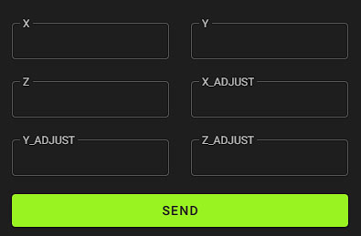
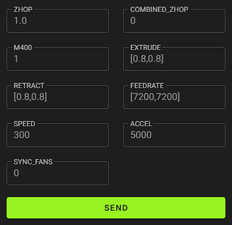

# V-Core IDEX for RatOS 2.X
This is a temporary RatOS IDEX Implementation. It will be online until RatOS gets this feature
- RatOS macro compatibility 
- octopus v1.1 idex board configuration 
- dual EBB42 toolboards with autoflashing
- native IDEX copy and mirror mode 
- adaptive bed meshing for both toolheads
- ultra fast toolchanges

# V-Core IDEX toolchange video
[](https://youtu.be/lKBVmPfxjEk)

# Hardware
- Left toolhead **MUST** be the ```Dual Carriage``` toolhead
- Right toolhead **MUST** be the ```X``` toolhead
- Name your extruders ```extruder``` *left* and ```extruder1``` *right*
- Name your toolboards ```toolboard``` *left* and ```toolboardb``` *right*
- Name your toolboard adxl ```adxl345 toolboard``` *left* and ```adxl345 toolboardb``` *right*
- Name your part cooling fans ```heater_fan toolhead_cooling_fan``` *left* and ```heater_fan toolhead_cooling_fanb``` *right*
- The z-probe **MUST** be on to the right toolhead
- make sure the left nozzle is **NOT** lower then the right nozzle, ideally they have the same z-offset

# Install RatOS IDEX
**1. install RatOS for V-Core 3**

**2. update klipper**

**3. copy the files**
- copy the [custom](/klipper_config/custom) folder into ```~/printer_data/config```
- copy the [ratos-variables.cfg](/klipper_config/ratos-variables.cfg) file into ```~/printer_data/config/```
- copy the [btt-ebb42-12b](/klipper_config/RatOS/boards) folder into ```~/printer_data/config/RatOS/boards```

**4. enable IDEX input shaper scripts**
```ini
chmod 750 ~/printer_data/config/custom/scripts/*.sh
```

**5. enable secondary BTT EBB42 V1.2 auto flashing**
```ini
sudo ~/printer_data/config/RatOS/scripts/ratos-update.sh
```

**6. restart the pi**

**7. configure your printer.cfg**
- use the example [IDEX printer.cfg](/klipper_config/printer.cfg) 

# Manual toolhead offset calibration
- for the X and Y calibration use the `calibrate_separation` macro to print the calibration lines, you are responsible for heating up your bed and extruders, dont forget to z-tilt and the bed mesh
- use the `SET_SEPARATION` macro to enter your toolhead offsets from the left toolhead



- *`X=1` to set the x-offset to 1*
- *`X_ADJUST=1` to add 1 to the current x-offset*
- *`X_ADJUST=-1` to subtract 1 from the current x-offset*

# Toolchange configuration
- `ZHOP` Z-Hop before and after the toolchange, in addition to the slicer z-hop 
- `COMBINED_ZHOP` 0=OFF 1=ON. Combines z-hop/z-drop with retraction/deretraction moves
- `M400` 0=OFF 1=ON. Turn M400, for the z-hops and z-drops, on or off
- `RETRACT` Retraction before the toolchange
- `EXTRUDE` Extrusion after the toolchange
- `FEEDRATE` Feedrate for retract/extrude
- `SPEED` XY Travel Speed
- `ACCEL` XY Travel Accel
- `SYNC_FANS` 0=OFF 1=ON. Forces fan synchronisation in single mode



# IDEX modes
- by default the printer will be in single toolhead mode.
- to enable the Copy or Mirror mode for the next print, home your printer and then execute the ```IDEX_COPY``` or ```IDEX_MIRROR``` GCODE macro.
- execute ```IDEX_SINGLE``` to switch back to normal mode.
# Prusa Slicer / Super Slicer

- Start G-Code
```ini
START_PRINT EXTRUDER_TEMP={first_layer_temperature[0]} EXTRUDER_TEMP_1={first_layer_temperature[1]} EXTRUDER_OTHER_LAYER_TEMP={temperature[0]} EXTRUDER_OTHER_LAYER_TEMP_1={temperature[1]} BED_TEMP=[first_layer_bed_temperature] X0={first_layer_print_min[0]} Y0={first_layer_print_min[1]} X1={first_layer_print_max[0]} Y1={first_layer_print_max[1]} INITIAL_TOOL={initial_tool}
```

- End G-Code
```ini
END_PRINT
```

- Before layer change G-Code
```ini
_LAYER_CHANGE
```

- Tool change G-Code. 
Both lines are important
```ini
;tool change post processor tag
T[next_extruder] P1
```

- Post processing script. 
Optional but recommended, tells klipper if all toolheads are in use.
```ini
ENTER_YOUR_PATH_TO_PYTHON\python3.exe "ENTER_YOUR_PATH_TO_THE_FILE\postprocessor.py"
```

- Super fast tool changes post processing script. 
EXPERIMENTAL, ultra fast and seamless IDEX toolchanges. 
```ini
ENTER_YOUR_PATH_TO_PYTHON\python3.exe "ENTER_YOUR_PATH_TO_THE_FILE\ftc.py"
```
