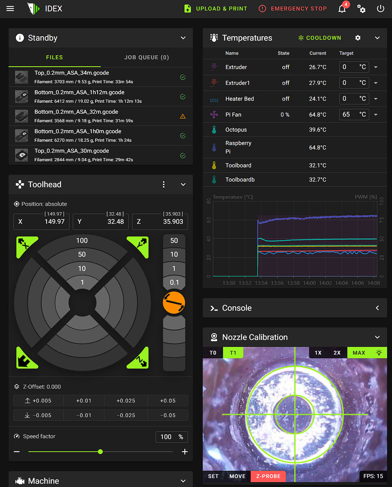

# V-Core IDEX for RatOS 2.X

THIS ISNT A TUTORIAL OR A DOCUMENTATION!

THIS IS MY PRIVATE CONFIGURATION I SHARE!

THIS IS ONYL FOR EXPERIENCED USERS, YOU SHOULD KNOW HOW KLIPPER WORKS AND BE ABLE TO CREATE YOUR OWN HARDWARE CONFIGURAITON BEFORE TOUCHING THIS!


This is a unofficial and temporary RatOS V2.X IDEX Implementation. Consider it as beta or alpha. 
Macros are based on [Mikkel Schmidt`s](https://github.com/miklschmidt) work and have been modified and extended by [Helge Keck](https://github.com/HelgeKeck).

- RatOS macro compatibility 
- V-Core IDEX Mainsail
- octopus v1.1 idex board configuration 
- dual EBB42 toolboards with autoflashing
- native IDEX copy and mirror mode 
- improved hybrid corexy kinematics with AWD and single toolhead support 
- adaptive bed meshing for both toolheads
- z-probing with both toolheads
- idex copy and mirror mode input shaping
- ultra fast toolchanges, up to 0.3 seconds
- visual assisted toolhead offset calibration
- built in z-offset probe support

# V-Core IDEX toolchange video
[](https://youtu.be/lKBVmPfxjEk)

# Hardware
- Left toolhead **MUST** be the ```X``` toolhead
- Right toolhead **MUST** be the ```Dual Carriage``` toolhead
- Name your extruders ```extruder``` *left* and ```extruder1``` *right*
- Name your toolboards ```toolboard``` *left* and ```toolboardb``` *right*
- Name your toolboard adxl ```adxl345 toolboard``` *left* and ```adxl345 toolboardb``` *right*
- Name your part cooling fans ```fan_generic fan_extruder``` *left* and ```fan_generic fan_extruder1``` *right*
- make sure the nozzle from the z-probe toolhead is **NOT** higher then the other nozzle, ideally they have the same z-offset
- place the `X` and `DUAL_CARRIAGE` endstop stoppers as much outside as possible, to their max positions where they still work
- tune the `X` and `DUAL_CARRIAGE` `endstop_position` values to its correct positions 
- your toolhead offsets should be less than 1mm
- if T1 is primary, make sure T0 has a positive x offset, and reverse

# Install RatOS IDEX
- install RatOS for V-Core 3
- update klipper
- clone the idex repo
```
cd ~/
git clone https://github.com/HelgeKeck/vcore-idex.git
bash ~/vcore-idex/install.sh
```
- add the update manager entry to the moonraker.conf file in your config folder
```ini
[update_manager IDEX]
type: git_repo
primary_branch: main
path: ~/vcore-idex
origin: https://github.com/HelgeKeck/vcore-idex.git
managed_services:
	klipper
```
- reboot, not your laptop

# Inverted Hybrid CoreXY Kinematics
add this to your printer.cfg
```ini
[hybrid_corexy]
inverted: true
```

# IDEX modes
- by default the printer will be in single toolhead mode.
- to enable the Copy or Mirror mode for the next print, home your printer and then execute the ```IDEX_COPY``` or ```IDEX_MIRROR``` GCODE macro.
- execute ```IDEX_SINGLE``` to switch back to normal mode.

G-Code Macros: 
- [IDEX_SINGLE](klipper_config/custom/macros/idex.cfg#L1) 
- [IDEX_COPY](klipper_config/custom/macros/idex.cfg#L64) 
- [IDEX_MIRROR](klipper_config/custom/macros/idex.cfg#L120) 

# Toolchange configuration
- `ZHOP` Z-Hop before and after the toolchange, in addition to the slicer z-hop 
- `COMBINED_ZHOP` 0=OFF 1=ON. Combines z-hop/z-drop with retraction/deretraction moves
- `M400` 0=OFF 1=ON. Turn M400, for the z-hops and z-drops, on or off
- `RETRACT` Retraction before the toolchange
- `EXTRUDE` Extrusion after the toolchange
- `FEEDRATE` Feedrate for retract/extrude
- `SPEED` XY Travel Speed
- `ACCEL` XY Travel Accel
- `SYNC_FANS` 0=OFF 1=ON. Forces fan synchronisation in single mode. *Helpful because the new ultra fast toolchanges can be **MUCH** faster than your part cooling fan spin up time. **TIP! The Sanyo Denki 9GAX0412P3S001 4028 is almost as fast as the toolchanges***   


G-Code Macro: 
- [IDEX_CONFIG](klipper_config/custom/macros/idex.cfg#L248) 

# Manual toolhead offset calibration
- for the X and Y calibration use the `calibrate_separation` macro to print the calibration lines, you are responsible for heating up your bed and extruders, dont forget to z-tilt and the bed mesh
- use the `SET_SEPARATION` macro to enter your toolhead offsets from the left toolhead


- *`X=1` to set the x-offset to 1*
- *`X_ADJUST=1` to add 1 to the current x-offset*
- *`X_ADJUST=-1` to subtract 1 from the current x-offset*

G-Code Macros: 
- [SET_SEPARATION](klipper_config/custom/macros/nozzle_calibration.cfg#L11) 
- [CALIBRATE_SEPARATION](klipper_config/custom/macros/nozzle_calibration.cfg#L47) 

# V-Core IDEX Mainsail

- This [fork](https://github.com/HelgeKeck/mainsail) contains some changes for IDEX printers.

- Visual assisted toolhead offset calibration [read more](doc/vaoc.md)



- Idex mode controls 


- Idex extruder controls 


# Prusa Slicer / Super Slicer

- Start G-Code
```ini
START_PRINT EXTRUDER_TEMP={first_layer_temperature[0]} EXTRUDER_TEMP_1={first_layer_temperature[1]} EXTRUDER_OTHER_LAYER_TEMP={temperature[0]} EXTRUDER_OTHER_LAYER_TEMP_1={temperature[1]} BED_TEMP=[first_layer_bed_temperature] X0={first_layer_print_min[0]} Y0={first_layer_print_min[1]} X1={first_layer_print_max[0]} Y1={first_layer_print_max[1]} INITIAL_TOOL={initial_tool} COLOR={extruder_colour[0]} COLOR_1={extruder_colour[1]}
```

- End G-Code
```ini
END_PRINT
```

- Before layer change G-Code
```ini
_LAYER_CHANGE
```

- Tool change G-Code. 
Both lines are important
```ini
;tool change post processor tag
T[next_extruder] P1
```

- Filament G-code, setting pressure advance for IDEX printer
```ini
; Filament gcode
SET_PRESSURE_ADVANCE EXTRUDER={if current_extruder==0}extruder{else}extruder1{endif} ADVANCE=0.1 SMOOTH_TIME=0.04
```

- G-code substitutions


- Post processing script. 
Optional but recommended, tells klipper if all toolheads are in use.
```ini
ENTER_YOUR_PATH_TO_PYTHON\python3.exe "ENTER_YOUR_PATH_TO_THE_FILE\postprocessor.py"
```

- Super fast tool changes post processing script. 
EXPERIMENTAL, ultra fast and seamless IDEX toolchanges. 
```ini
ENTER_YOUR_PATH_TO_PYTHON\python3.exe "ENTER_YOUR_PATH_TO_THE_FILE\ftc.py"
```
