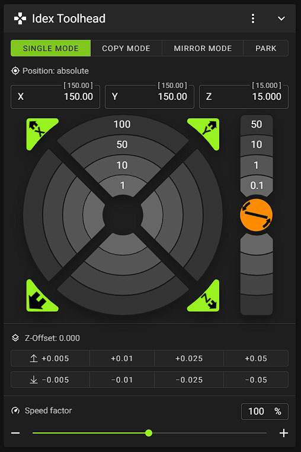

# V-Core IDEX for RatOS 2.X
This is a unofficial and temporary RatOS V2.X IDEX Implementation. Consider it as beta or alpha. 
Macros are based on Mikkel Schmidt`s work and have been modified and extended by Helge Keck.

- RatOS macro compatibility 
- octopus v1.1 idex board configuration 
- dual EBB42 toolboards with autoflashing
- native IDEX copy and mirror mode 
- adaptive bed meshing for both toolheads
- **NEW!** - ultra fast toolchanges, up to 0.3 seconds
- **NEW!** - visual assisted toolhead offset calibration
- **NEW!** - built in z-offset probe support
- **NEW!** - [better oozeguards](oozeguard)
<!-- - **NEW!** - IDEX ***spool mode***, infinite spool feature  
- **NEW!** - IDEX ***mixed mode***, inversed multicolor prints in copy and mirror mode  
- **NEW!** - IDEX ***free mode***, soon  -->

# V-Core IDEX toolchange video
[](https://youtu.be/lKBVmPfxjEk)

# Hardware
- Left toolhead **MUST** be the ```X``` toolhead
- Right toolhead **MUST** be the ```Dual Carriage``` toolhead
- Name your extruders ```extruder``` *left* and ```extruder1``` *right*
- Name your toolboards ```toolboard``` *left* and ```toolboardb``` *right*
- Name your toolboard adxl ```adxl345 toolboard``` *left* and ```adxl345 toolboardb``` *right*
- Name your part cooling fans ```heater_fan toolhead_cooling_fan``` *left* and ```heater_fan toolhead_cooling_fanb``` *right*
- make sure the nozzle from the z-probe toolhead is **NOT** higher then the other nozzle, ideally they have the same z-offset
- place the `X` and `DUAL_CARRIAGE` endstop stoppers as much outside as possible, to their max positions where they still work
- tune the `X` and `DUAL_CARRIAGE` `endstop_position` values to its correct positions 
- your toolhead offsets should be less than 1mm

# **CHANGE**! Inverted hybrid core-xy
You need to activate the new `inverted` setting in your `dual_carriage` configuration
```
[dual_carriage]
inverted: True
```

# **CHANGE**! Toolhead order
The `X` and `Dual Carriage` positions have changed. Make sure your toolheads are on the correct side, you might need to swap the stepper connectors on your board. You maybe need to swap your x and dc endstop pins as well.
- Left toolhead **MUST** be the ```X``` toolhead
- Right toolhead **MUST** be the ```Dual Carriage``` toolhead
- you also need to swap these values from one stepper to the other. *but keep your settings of course, dont use mine.*
```
[stepper_x]
position_endstop: -74
position_min: -74
position_max: 376

[dual_carriage]
position_endstop: 376
position_max: 376
position_min: -74
```

# **CHANGE**! Probing with both toolheads
You can now put the z-probe on any of the toolheads. Configure it with the RatOS Variable `default_toolhead`.
```
[gcode_macro RatOS]
variable_default_toolhead: 1 		# 0 = Left, 1 = Right
```

# **CHANGE**! Run the install script again 
Run the install script again if you have updated from a previous version.
```
bash ~/vcore-idex/install.sh
```

# Install RatOS IDEX
- install RatOS for V-Core 3
- update klipper
- clone the idex repo
```
cd ~/
git clone https://github.com/HelgeKeck/vcore-idex.git
bash ~/vcore-idex/install.sh
```
- add the update manager entry to the moonraker.conf file in your config folder
```ini
[update_manager IDEX]
type: git_repo
primary_branch: main
path: ~/vcore-idex
origin: https://github.com/HelgeKeck/vcore-idex.git
managed_services:
	klipper
```
- reboot, not your laptop

# IDEX modes
- by default the printer will be in single toolhead mode.
- to enable the Copy or Mirror mode for the next print, home your printer and then execute the ```IDEX_COPY``` or ```IDEX_MIRROR``` GCODE macro.
- execute ```IDEX_SINGLE``` to switch back to normal mode.

# Toolchange configuration
- `ZHOP` Z-Hop before and after the toolchange, in addition to the slicer z-hop 
- `COMBINED_ZHOP` 0=OFF 1=ON. Combines z-hop/z-drop with retraction/deretraction moves
- `M400` 0=OFF 1=ON. Turn M400, for the z-hops and z-drops, on or off
- `RETRACT` Retraction before the toolchange
- `EXTRUDE` Extrusion after the toolchange
- `FEEDRATE` Feedrate for retract/extrude
- `SPEED` XY Travel Speed
- `ACCEL` XY Travel Accel
- `SYNC_FANS` 0=OFF 1=ON. Forces fan synchronisation in single mode. *Helpful because the new ultra fast toolchanges can be **MUCH** faster than your part cooling fan spin up time. **TIP! The Sanyo Denki 9GAX0412P3S001 4028 is almost as fast as the toolchanges***   


# Manual toolhead offset calibration
- for the X and Y calibration use the `calibrate_separation` macro to print the calibration lines, you are responsible for heating up your bed and extruders, dont forget to z-tilt and the bed mesh
- use the `SET_SEPARATION` macro to enter your toolhead offsets from the left toolhead


- *`X=1` to set the x-offset to 1*
- *`X_ADJUST=1` to add 1 to the current x-offset*
- *`X_ADJUST=-1` to subtract 1 from the current x-offset*

# IDEX Mainsail modifications

- Visual assisted toolhead offset calibration [read more](doc/vaoc.md)


- Idex mode controls 



- Idex extruder controls 


# **CHANGE**! Prusa Slicer / Super Slicer

- Start G-Code
```ini
START_PRINT EXTRUDER_TEMP={first_layer_temperature[0]} EXTRUDER_TEMP_1={first_layer_temperature[1]} EXTRUDER_OTHER_LAYER_TEMP={temperature[0]} EXTRUDER_OTHER_LAYER_TEMP_1={temperature[1]} BED_TEMP=[first_layer_bed_temperature] X0={first_layer_print_min[0]} Y0={first_layer_print_min[1]} X1={first_layer_print_max[0]} Y1={first_layer_print_max[1]} INITIAL_TOOL={initial_tool} COLOR={extruder_colour[0]} COLOR_1={extruder_colour[1]}
```

- End G-Code
```ini
END_PRINT
```

- Before layer change G-Code
```ini
_LAYER_CHANGE
```

- Tool change G-Code. 
Both lines are important
```ini
;tool change post processor tag
T[next_extruder] P1
```

- G-code substitutions


- Post processing script. 
Optional but recommended, tells klipper if all toolheads are in use.
```ini
ENTER_YOUR_PATH_TO_PYTHON\python3.exe "ENTER_YOUR_PATH_TO_THE_FILE\postprocessor.py"
```

- Super fast tool changes post processing script. 
EXPERIMENTAL, ultra fast and seamless IDEX toolchanges. 
```ini
ENTER_YOUR_PATH_TO_PYTHON\python3.exe "ENTER_YOUR_PATH_TO_THE_FILE\ftc.py"
```
