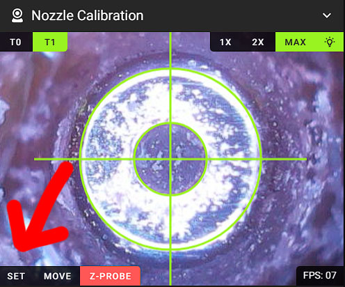

# **VAOC** - *Visual Assisted Offset Calibration*
Use a cheap camera, like a raspi 5MP, to get easy, fast and perfect toolhead offsets. In seconds.
- full RatOS 2.X compatibility
- [macros](../klipper_config/custom/macros/nozzle_calibration.cfg#L94) can easily be changed to work with toolchanger or other non RatOS printers
- directly integrated into the mainsail user interface
- ultra fast drag and drop XY-offset calibration.
- manual XY-offset calibration through the mainsail navigation buttons
- manual Z-offset calibration based on camera focus, sub 0.1mm accuracy
- one click auto z-offset calibration with a optional switch, 0.00Xmm accuracy  
- control a camera LED directly through the interface
- supports the new ultra fast toolchanges, switch between toolheads in a blink of an eye
- [watch the drag and drop XY-Offset calibration video](https://youtu.be/3SWbWAmu-hM)
- [watch the automatic Z-Offset probe calibration video](https://youtu.be/InJN57BFA_c)
- [watch the ultra fast toolchange video](https://youtu.be/YhUzwRg1qpU)


# Requirements
- instead of the public mainsail release, use this [fork](https://github.com/HelgeKeck/mainsail/tree/nozzle-offset-calibration) instead.
- Adaptive MJPEG-Streamer camera, i recommend the raspberry PI 5MP camera.
- set the camera to its highest resolution.
- for RatOS, the [ratos-variables.cfg](../klipper_config/ratos-variables.cfg) in your config folder.

# RatOS: Install the VAOC mainsail fork

add the update manager entry to the moonraker.conf file in your config folder

```ini
[update_manager mainsail]
repo: HelgeKeck/mainsail
```

restart klipper and moonraker

go to the machine tab and update mainsail

# Manual installation of the VAOC mainsail fork
***Skip these steps if you use RatOS!*** 

clone the repo

```ini
cd ~
git clone https://github.com/HelgeKeck/mainsail.git mainsail-source
cd ~/mainsail-source
npm install
git checkout nozzle-offset-calibration
```

build distribution

```ini
cd ~/mainsail-source
npm run build
```

deploy distribution

```ini
sudo cp -av ~/mainsail-source/dist/* ~/mainsail
```

update repo

```ini
cd ~/mainsail-source
git pull
```

# Camera LED configuration
Control a camera LED through the VAOC interface.

```ini
[neopixel nozzle_calibration_led]
pin: PE15
chain_count: 4
color_order: GRB
initial_RED: 0.0
initial_GREEN: 0.0
```

VAOC enables the LED on/off switch if it detects a LED with the name `nozzle_calibration_led`.


G-Code Macros: 
- [NOZZLE_CALIBRATION_LIGHT_ON](../klipper_config/custom/macros/nozzle_calibration.cfg#L243) 
- [NOZZLE_CALIBRATION_LIGHT_OFF](../klipper_config/custom/macros/nozzle_calibration.cfg#L248) 

# Z-Offset Probe configuration
The Z-Offset probe works exactly like a Super Pinda does, with all sanity checks, safety features and g-code commands like `Z_OFFSET_PROBE`, `Z_OFFSET_QUERY_PROBE` and `Z_OFFSET_PROBE_ACCURACY` . It has the same code base with just a few changes.

```ini
[zoffsetprobe]
pin: ^!PE7                      # probe trigger pin
z_offset: 22.0                  # probe height, used to limit the probe z-move
y_offset: 22.5                  # probe y-offset, measured from the camera center
x_offset: 0                     # probe x-offset, measured from the camera center
speed: 10                       
samples: 3                      
sample_retract_dist: 5
lift_speed: 10.0
samples_result: median
samples_tolerance: 0.2
samples_tolerance_retries: 5
```

VAOC enables the z-offset probe button if it detects the configured `zoffsetprobe` object.


For safety reasons this button is by default disabled, its only active righ after pressing `SET`. Make sure your nozzle is centered on the camera before pressing that button.

G-Code Macros: 
- [_NOZZLE_CALIBRATION_PROBE_Z_OFFSET](../klipper_config/custom/macros/nozzle_calibration.cfg#L154) 

# Activate the webcam overlay


# Webcam orientation
change the webcam image orientation so that the nozzle moves in the correct directions


# Drag and drop orientation
change the drag and drop orientation if needed


# Calibrate Pixel per MM value
change the `Pixel per MM` value. Best is to open two windows, one with the webcam panel open.


**1.** home your printer

**2.** move the nozzle directly over the camera, make sure the nozzle is centered

**3.** move in Z to focus on the nozzle tip

**4.** roughly change the `Pixel per MM` value until it looks like this.  


*The inner circle size is caclulated by `Pixel per MM` x `nozzle_diameter`, the outer one by `Pixel per MM` x `1.0mm`*


**5.** move the toolhead 1mm to the right side

**6.** compare point 1 and 2 to test if the toolhead moved exactly 1mm or not


# Set the reference point
**1.** home your printer 

**2.** activate the primary toolhead, *T1 for the V-Core IDEX*

**3.** place the camera on the build plate

**4.** move the nozzle directly over the camera, center the nozzle, Make sure the nozzle tip is in focus. 

**5.** press `SET` in the UI. 



This will save the current coordinates and uses them as the reference point. Every time you activate the primary toolhead, through the VAOC interface, it will move to this position 

**6.** after you press `set`, and if you have a z-offset probe configured, the red `Z-PROBE` button will apear. Press it to probe the primary toolhead and to store the reference z-offset point.  

G-Code Macros: 
- [_NOZZLE_CALIBRATION_LOAD_TOOL](../klipper_config/custom/macros/nozzle_calibration.cfg#L97) 
- [_NOZZLE_CALIBRATION_SET_TOOL](../klipper_config/custom/macros/nozzle_calibration.cfg#L119) 

# Set the toolhead offset 
**1.** load the primary toolhead to its reference point, *T1 for the V-Core IDEX*, make some adjustments if needed

**2.** load the seconodary toolhead by clicking `T0` or `T1`, *T0 for the V-Core IDEX*, from the VAOC interface. 

**3.** move the nozzle to its correct xy position. 

**4.** move in z to focus the nozzle

**5.** press `SET` in the UI. 

**6.** after you press `set`, and if you have a z-offset probe configured, the red `Z-PROBE` button will apear. Press it for the automatic z-offset calibration. Results will be stored automatically.  
 
G-Code Macros: 
- [_NOZZLE_CALIBRATION_LOAD_TOOL](../klipper_config/custom/macros/nozzle_calibration.cfg#L97) 
- [_NOZZLE_CALIBRATION_SET_TOOL](../klipper_config/custom/macros/nozzle_calibration.cfg#L119) 
