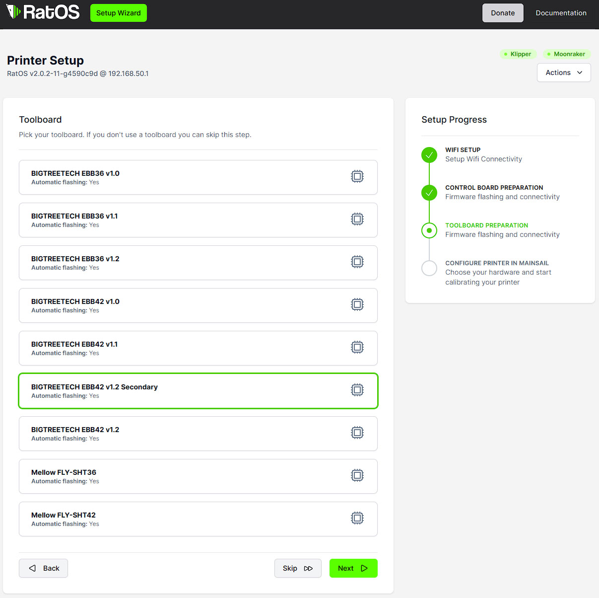

# Hardware Installation
- Left toolhead **MUST** be the ```Dual Carriage``` toolhead
- Right toolhead **MUST** be the ```X``` toolhead
- Name your extruders ```extruder``` *left* and ```extruder1``` *right*
- Name your toolboards ```toolboard``` *left* and ```toolboardb``` *right*
- Name your toolboard adxl ```adxl345 toolboard``` *left* and ```adxl345 toolboardb``` *right*
- Name your part cooling fans ```heater_fan toolhead_cooling_fan``` *left* and ```heater_fan toolhead_cooling_fanb``` *right*
- The z-probe **MUST** be on to the right toolhead

# Secondary BTT EBB42 V1.2 autoflashing
- copy the [btt-ebb42-12b](/klipper_config/RatOS/boards) folder into the ```~/printer_data/config/RatOS/boards``` folder on your raspberry PI
- ssh into the PI and run `sudo ~/printer_data/config/RatOS/scripts/ratos-update.sh`
- restart the PI
- you can now flash and autoflash the secondary toolboard



