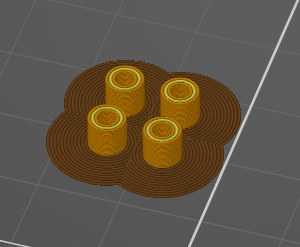
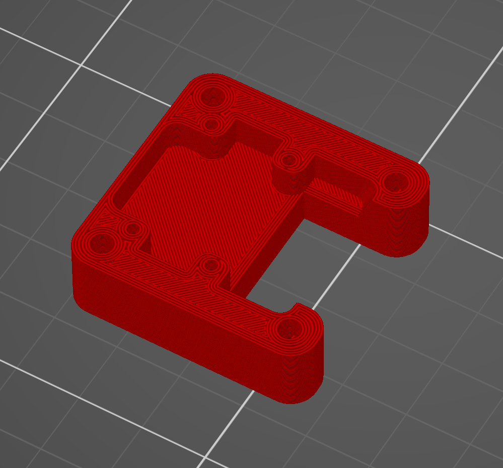
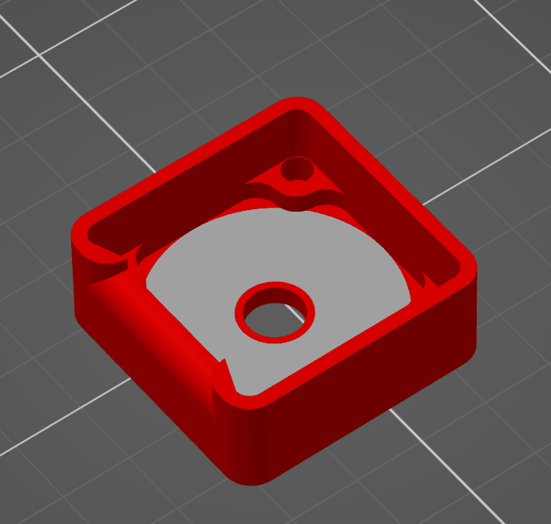
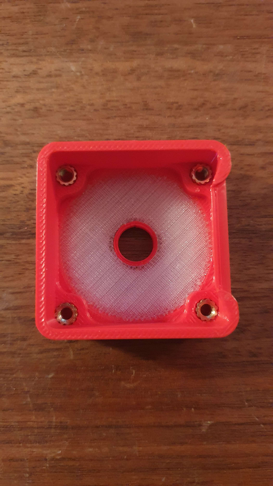

# VAOC Camera Case with LED Ring

STL Files
files are already in correct print orientation

Printing

Print the spacers with a 5mm brim

bottom part doesnt need any special print settings

Drag the Top and Diffusor part at the same time into the slicer

red = Top part, white = Diffusor part

If you have a multimaterial printer availalbe you can print the diffusor part with transparent filament. In this case i suggest to print it with 100% Line Infill. If you dont have transparent Filament you can use white Filament and printing it with 10% infill and only 2 bottom and top layers
 
if you dont have a multimaterial printer, print the whole case out of white filament. Make sure to print the Diffusor part with 10% infill and 2 bottom and top layers, but the case with normal print settings to ensure some stability

Building the case

put the 4 heat inserts into the top part

make sure the M2x10 screws can go through each of the spacer

make sure the M2x10 screws can enter the 4 holes. there is some post processing needed

put the magnets into the bottom part. make sure they have all the same polarity

solder ~25mm cables to the HDMI adapter board and the LED ring

make sure you use the exact same holes, there should be one pin empty on the left side 

IMPORTANT
do not follow the color code from my wiring, i made a mistake
. 
on the Adapter Board from left to right
GND
5V
Signal
solder the cables to the LED ring
 
DI = Signal
GND = GND
5V = 5V
 
do not use the DO pin on the LED ring 
please remember your color coding for later, the other HDMI adapter on the raspberry pi needs to follow the same order

Connect the HDMI adapter to the Camera 

the connected PCB and camera

